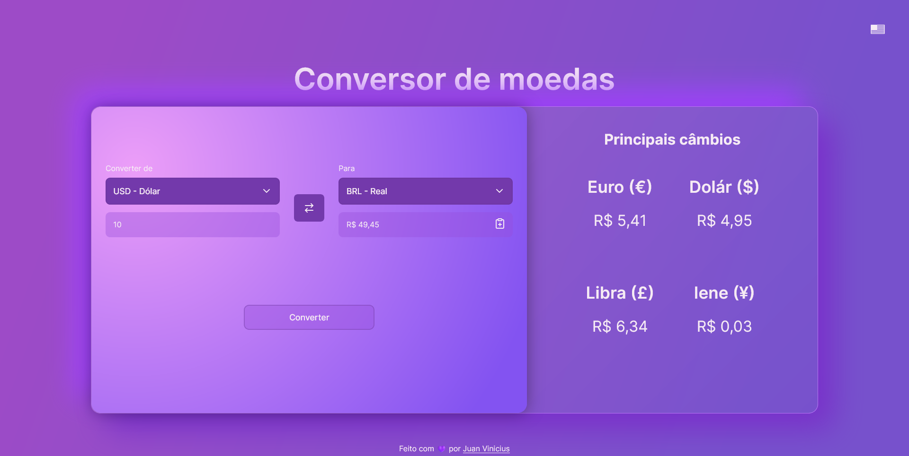
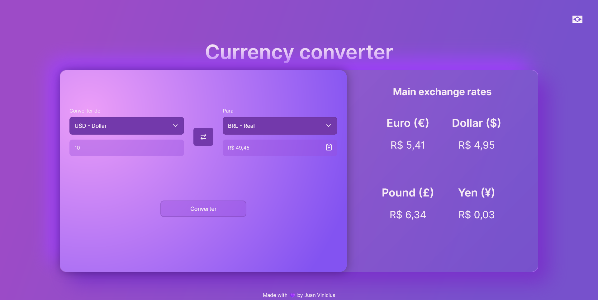
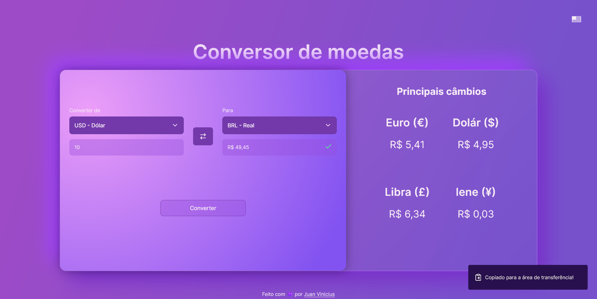

# Conversor de moedas 

Aplicação criada para conversão de moedas, sendo disponibilizado as seguintes moedas:

* BRL (R$)
* USD ($)
* EUR (€)
* GBP (£)
* JPY (¥)

## Stack utilizada

**Front-end:** HTML, CSS, JavaScript

## APIs utilizadas

 - [Lucide Icons](https://lucide.dev/)
 - [Exchangerate Api](https://www.exchangerate-api.com/)

## Screenshots

